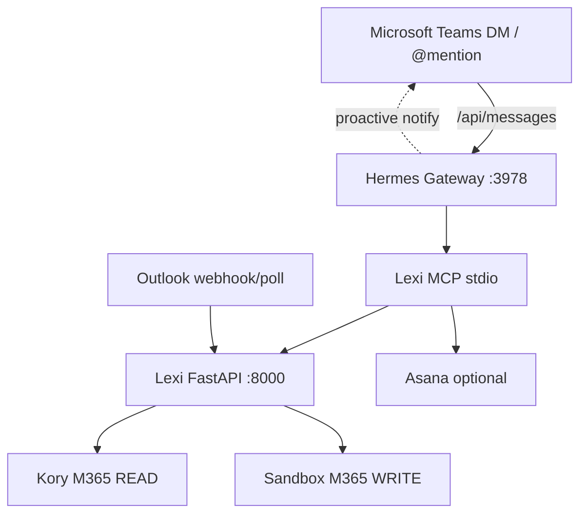

# Lexi + Hermes — Final Plan (Teams → Hermes, Lindy-class scheduling)

**Status:** FINAL PLAN — implement only after approval.  
**Date:** 2026-06-10  
**Audience:** Kory pilot + engineering.

---

## 1. Decision summary

| Topic | Final decision |
|-------|----------------|
| **Teams messaging endpoint** | Public HTTPS → **Hermes gateway `:3978/api/messages`** (not Lexi `:8000`) |
| **Conversational brain** | **Hermes** (Claude + `agent_instructions.txt` + memory) |
| **Execution layer** | **Lexi** (Composio, rules, calendar, email, holds, audit) via **MCP** `hermes_mcp_server.py` |
| **Teams app name** | Existing Teams bot (register/update endpoint with `teams app update`) |
| **Email ingress** | Stays on **Lexi `:8000`** (`/webhooks/composio`, orchestrator poll) |
| **Pilot writes** | `LEXI_WRITE_MODE=sandbox` (read Kory, write operator mailbox) until UAT |
| **Approvals** | Kory approves **everything** in Phase 1 — via Teams chat with Hermes (text or cards) |
| **Asana reminders** | On Kory's board when meal/venue + Kory confirms; `ASANA_ENABLED` flag |
| **Rules source of truth** | `rules.py` + `agent_instructions.txt` — calendar truth from **Kory Outlook read** |

**Deprecate for production:** Lexi `LexiTeamsBot` on `:8000` as the Azure target. Keep `:8000` for webhooks, orchestrator, dashboard (debug only), MCP host process.

---

## 2. Target architecture

```text
┌─────────────────────────────────────────────────────────────────────────┐
│ MICROSOFT TEAMS                                                          │
│  DM: every message  │  Group/channel: @mention only                      │
│  Bot: Hermes (existing Teams app)                                        │
└───────────────────────────────┬─────────────────────────────────────────┘
                                │ HTTPS POST /api/messages
                                ▼
┌─────────────────────────────────────────────────────────────────────────┐
│ HERMES GATEWAY (:3978)                                                   │
│  • Claude (ANTHROPIC_API_KEY or OAuth)                                   │
│  • Multi-turn chat, memory, proactive nudges                             │
│  • Strips <at> mentions, enforces TEAMS_ALLOWED_USERS                    │
│  • Calls MCP tools only — never Composio directly                        │
│  ~/.hermes/.env + config.yaml (platforms.teams.enabled)                  │
└───────────────────────────────┬─────────────────────────────────────────┘
                                │ stdio MCP
                                ▼
┌─────────────────────────────────────────────────────────────────────────┐
│ LEXI MCP (hermes_mcp_server.py) + Lexi Core (:8000 background)           │
│  MCP: calendar, inbox, propose, holds, draft/send, queue, approve        │
│  :8000: Composio webhooks, orchestrator, SQLite audit                    │
└───────────────────────────────┬─────────────────────────────────────────┘
                                │ Composio
          ┌─────────────────────┼─────────────────────┐
          ▼                     ▼                     ▼
   READ: Kory Outlook    WRITE: sandbox Outlook   ASANA: Kory board
   (inbox + calendar)    (holds, confirm, email)   (reservation reminders)
```



---

## 3. Lindy-class capabilities — map to build

| Capability | Target behavior | Today | Phase |
|------------|-----------------|-------|-------|
| Check availability across timezones | Read Kory calendar; offer slots in recipient TZ + MT in emails | Partial (LLM prompt + read calendar) | P1 validators + P2 TZ helper |
| Back-and-forth on meeting requests | Email thread + Teams chat; reschedule offers 2 options, 1-day reply | Email pipeline only | P2 thread memory + follow-up daemon |
| Booking confirmations | On approve → confirm event + send email | **Works** (sandbox loopback) | P1 |
| Calendar sync / holds when offering | Hold **all** 2–3 offered slots on calendar | **Works** inbound; outbound fixed | P1 unify |
| Hold cleanup if no reply 2–3 days | Remind + release holds; Friday cleanup for next week | **Not built** | P2 hold lifecycle job |
| Session memory | Remember attendee, intent, draft across Teams messages | `scheduling_sessions` table exists, not wired to Hermes | P2 |
| Judgment from instructions + rules | `rules.py` enforced before staging | Partial validators | P1 expand validators |
| Proactive Teams messages | "You have 2 pending approvals" / hold expiring | Not on Hermes path | P2 proactive cron → Teams |
| Multi-person coordination | Find mutual slots (future) | **Not built** | P3 |
| Post-meeting follow-up drafts | Draft follow-up email | Hermes can draft via MCP | P2 templates |
| Asana reservation reminders | Lunch/dinner → Kory board section | Built; paused `ASANA_ENABLED=false` | P1 enable on confirm |
| Podcast low urgency | 3–4 weeks out unless backlog low | **Not in rules engine** | P2 intent priority |
| New client same-week urgency | Elevate priority + same-week slots | Keyword partial | P1 triage rules |

**Calendar comes first:** every slot proposal must pass (1) Kory Outlook busy/free, (2) `rules.py` validators, (3) LLM draft quality.

---

## 4. Kory rules — enforcement model

### 4.1 Sources (do not duplicate)

| File | Role |
|------|------|
| `rules.py` | Machine-readable policy (durations, caps, blocks, tone) |
| `agent_instructions.txt` | Hermes behavior (chat flow, tool order, approvals) |
| `app/rules/validators.py` | Runtime hard checks on proposed slots |
| Kory Outlook calendar | **Ground truth** for busy/free (read connection) |

### 4.2 Must enforce in code (not LLM-only)

**Hard blocks (never offer / never book):**
- M/W/F trainer 6:30–8:00 AM
- Monday Doug 1:15–2:15 PM
- Thu Capital Demolition 7:00 AM (bi-weekly — check calendar event)
- YPO Forum, board meetings, HRT, family "Do Not Move", son pickup/dropoff (calendar + family cal when available)

**Hard nos (reject or warn + escalate):**
- Lunch default no; happy hour after 6 PM; >2 happy hours/week; >1 dinner/week; weekends; routine WOB override

**Offering times (Kory calendaring rules):**
- Always **2–3 options**
- **Hold every offered slot** on calendar immediately (tentative)
- If no reply in **2–3 days**: reminder + release hold + re-offer
- **Friday**: no holds left for following week (cleanup job)

**Reschedule:**
- Priority over new requests when possible
- Offer **2** options; hold both; **1 day** to reply before release

**Urgency:**
- New prospective clients → same week, high priority
- Podcast → low urgency, 3–4 weeks (unless backlog rule triggers)
- Don't offer slots unless meeting is necessary

**Email:**
- Recipient TZ first, MT in parentheses
- Sign off: **"Let's Win,"** / Kory
- Never mention YPO in outbound drafts

**Approvals:**
- **No one** books or sends without Kory explicit approve in Teams (Hermes → `approve_decision` MCP)

### 4.3 Asana (when enabled)

- Meal meetings (lunch/dinner) or venue intents → ask Kory in Teams: "Add reservation reminder to Asana?"
- On yes → `lexi_create_reservation_reminder` → Kory NON-IFG → Reservation Reminders section

---

## 5. Teams → Hermes setup (your existing bot)

Use **one** Teams app. Credentials live in **`~/.hermes/.env`** only for the gateway.

### Step A — Prerequisites
```bash
npm install -g @microsoft/teams.cli@preview
teams login
teams status --verbose   # copy your AAD object ID
```

### Step B — Tunnel (local dev)
```bash
# Default Hermes Teams port
export TEAMS_PORT=3978
ngrok http 3978
# or: devtunnel / cloudflared per Hermes docs
```

### Step C — Point **existing** bot at Hermes
```bash
teams app update --id <teamsAppId> \
  --endpoint "https://<tunnel-host>/api/messages"
```

If creating fresh:
```bash
teams app create --name "Hermes" --endpoint "https://<tunnel-host>/api/messages"
```

### Step D — `~/.hermes/.env`
```bash
TEAMS_CLIENT_ID=...
TEAMS_CLIENT_SECRET=...
TEAMS_TENANT_ID=...
TEAMS_ALLOWED_USERS=<your-aad-object-id>
ANTHROPIC_API_KEY=...
TEAMS_PORT=3978
```

### Step E — `~/.hermes/config.yaml`
```yaml
platforms:
  teams:
    enabled: true
    extra:
      client_id: "..."
      client_secret: "..."
      tenant_id: "..."
      port: 3978

mcp:
  servers:
    lexi-scheduling:
      command: "/path/to/AI_Scheduling_Agent/.venv/bin/python"
      args: ["/path/to/AI_Scheduling_Agent/hermes_mcp_server.py"]
      env:
        PYTHONPATH: "/path/to/AI_Scheduling_Agent"
```

Run: `python scripts/setup_hermes_mcp.py` for exact JSON snippet.

### Step F — Start gateway
```bash
# Docker (Hermes upstream)
HERMES_UID=$(id -u) HERMES_GID=$(id -g) docker compose up -d gateway

# OR Mac CLI
hermes gateway run --replace
```

Verify:
```bash
curl http://localhost:3978/health   # ok
docker logs hermes | grep "Webhook server listening"
```

### Step G — Install / DM bot
```bash
teams app get <teamsAppId> --install-link
```
Open link → install → DM bot → `help`

**Lexi `:8000`:** run separately for email webhooks (`uvicorn app.main:app --port 8000`). Do **not** register Azure to `:8000`.

---

## 6. Conversation flows (Hermes + MCP)

### A. Kory in Teams: "Schedule coffee with Jane next week"
1. Hermes clarifies: Jane's email, preferred days
2. `lexi_get_calendar_availability` + `lexi_validate_slots`
3. Propose 2–3 times in chat
4. Kory: "yes option 2" → `lexi_place_calendar_hold` (if not already held) + `lexi_draft_outbound_email`
5. Kory: "send it" → `lexi_send_outbound_email` confirm_send=true
6. Optional: `lexi_create_reservation_reminder` if coffee + Cherry Creek venue note

### B. Inbound email to Kory (background)
1. Composio webhook → Lexi `:8000` orchestrator
2. Triage → `propose_schedule` → holds on all slots → `pending_approval`
3. Hermes **proactive** (P2): Teams message "Proposal #12 — approve?"
4. Kory: `approve 12 option 1` → Hermes calls `approve_decision`

### C. Hold lifecycle (P2)
1. Daily job: holds older than 3 days → release + draft reminder email (pending approval)
2. Friday job: clear holds for next week
3. Notify Kory in Teams when action needed

---

## 7. What to change in repo (after approval)

| Change | Files / action |
|--------|----------------|
| **Stop** pointing Azure at Lexi `:8000` | Document only; remove `LexiTeamsBot` from production path |
| Align `app/main.py` header comment | Teams → Hermes :3978 |
| Expand `validators.py` | Weekly caps, coffee 90m, workout windows, urgency |
| Hold lifecycle daemon | `app/workflows/hold_lifecycle.py` + orchestrator cron |
| Wire `scheduling_sessions` to Hermes | MCP + Hermes system prompt |
| Proactive Teams notify | Hermes gateway home channel / cron (not Lexi publisher) |
| Sync `rules.py` with Kory Q&A paste | Fix duplicate Saturday key; add podcast urgency |
| `LEXI_TEAMS_ENABLED` | False on Lexi; Teams only via Hermes |
| Production cutover | `LEXI_WRITE_MODE=kory` |

**Do not merge** Lexi Teams bot and Hermes gateway — single Azure endpoint on Hermes only.

---

## 8. Implementation phases

### Phase 1 — Wire Teams to Hermes (pilot)
- [ ] Tunnel → `teams app update` → gateway :3978
- [ ] MCP Lexi registered in Hermes
- [ ] `agent_instructions.txt` loaded in Hermes session
- [ ] Email pipeline on `:8000` unchanged
- [ ] Approve inbound via Hermes MCP (`get_lexi_pending_queue_tool` / `approve_decision`)
- [ ] Expand core validators (6pm, weekend, 2–3 slots, holds on offer)

### Phase 2 — Lindy parity (core)
- [ ] `scheduling_sessions` for multi-turn Teams
- [ ] Hold reminder + release (2–3 day rule)
- [ ] Friday hold cleanup
- [ ] Proactive Teams notifications for pending approvals
- [ ] Reschedule flow (2 options, 1-day hold)
- [ ] Podcast vs new-client urgency in triage
- [ ] Enable Asana on Kory confirm only

### Phase 3 — Advanced
- [ ] Multi-attendee availability
- [ ] Family calendar read (if API available)
- [ ] Post-meeting follow-up templates
- [ ] `LEXI_WRITE_MODE=kory` production
- [ ] VPS production (no ngrok)

---

## 9. Testing matrix (no Azure vs with tunnel)

| Test | Without Teams tunnel | With Teams → Hermes |
|------|----------------------|---------------------|
| Unit / validators | `scripts/test_full_stack.py` | Same |
| Email → propose → holds | `lexi_console inject` + `:8000` | Same |
| Approve proposal | `lexi_console approve` or Hermes MCP | Teams DM → Hermes → MCP |
| Conversational schedule | `hermes` CLI + MCP | Teams DM |
| Live Composio | `test_sandbox_integration.py` | Same |

---

## 10. Credential hygiene

- **Two Teams apps exist today** (Lexi `.env` vs `~/.hermes/.env`) — pick **one** app for Hermes gateway; retire the other from Azure or repoint to avoid confusion.
- Rotate any secrets pasted in chat.
- `chmod 600 ~/.hermes/.env`

---

## 11. Approval checklist (sign-off before coding)

- [ ] Teams endpoint = Hermes `:3978` (not Lexi `:8000`)
- [ ] Pilot sandbox writes until Kory UAT
- [ ] Phase 1 approvals via Hermes chat only
- [ ] `rules.py` + calendar read = gate for all slots
- [ ] Holds on every offered slot; cleanup rules in Phase 2
- [ ] Asana paused until Phase 2 enable on confirm
- [ ] Existing Teams app ID used with `teams app update`

**When this checklist is approved, implementation starts with Phase 1 wiring only.**
